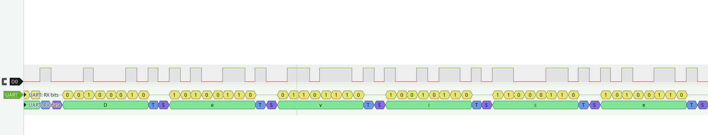

# Лабораторная №10. Работа с логическими анализаторами

## Цель работы

Изучить принципы работы логического анализатора, освоить методы использования библиотеки libgpiod2 для управления выводами GPIO, получить практические навыки анализа цифровых сигналов и протоколов с использованием программного обеспечения Sigrok/PulseView.

## Подготовительный материал

### Логический анализатор

При работе с различными электронными устройствами для анализа и понимания процессов на физическом уровне часто требуется использование специализированных измерительных приборов. Самым точным инструментом для анализа цифровых сигналов является осциллограф. Однако в случаях, когда высокая точность измерений не требуется, но необходима декодировка сигнала или длительная запись измерений, эффективным решением становится логический анализатор.

Логический анализатор — это инструмент для отладки цифровых протоколов, анализа временных характеристик и обнаружения аппаратных проблем. Прибор позволяет одновременно отслеживать состояние нескольких цифровых линий (каналов) и записывать изменения сигналов во времени.

В операционной системе ALT Linux доступны пакеты проекта Sigrok:

- [sigrok-cli](https://packages.altlinux.org/en/sisyphus/srpms/sigrok-cli/) — утилита командной строки
- [pulseview](https://packages.altlinux.org/en/sisyphus/srpms/pulseview/) — графический интерфейс

**Sigrok** — программный проект, обеспечивающий поддержку различных анализаторов сигналов. **Pulseview** — графическая оболочка для визуализации и декодирования данных.

### Установка программного обеспечения

Для работы с логическим анализатором необходимо установить следующие пакеты:

```
# apt-get install sigrok-cli sigrok-firmware-fx2lafw pulseview
```

После установки может потребоваться загрузка прошивки на анализатор:

```
$ sigrok-cli -d fx2lafw --driver-serial=XXXX -P
```

### Пример использования логического анализатора

Типичная задача для логического анализатора — измерение параметров цифрового сигнала на выводе GPIO. Например, на определённом пине гребёнки платы формируется сигнал с длительностью импульса 10 мс.

Для подключения анализатора необходимо соединить:

- Вывод GND анализатора с соответствующим пином земли на плате
- Канал CH1-CH8 с исследуемым пином

Запуск PulseView и выбор устройства:

```
$ pulseview
```

В окне выбора устройства выбрать анализатор fx2lafw и нажать Start. Результатом является график изменения сигналов по каналам, позволяющий измерить временные параметры импульсов.

На рисунке представлен пример измерения длительности импульса сигнала.

### Анализ протокола UART

Практическое применение логического анализатора — анализ работы последовательного интерфейса UART. На плате Lichee RV Dock при загрузке в UART-консоль выводится диагностическая информация.

Подключение анализатора:

- Вывод GND анализатора — к пину GND платы
- Канал CH0 — к пину TX платы

Настройка PulseView для анализа UART:

1. Удалить лишние каналы, оставить первый
2. Установить частоту дискретизации 1 MHz
3. Добавить декодер протокола: кнопка "Add protocol decoder" → UART

Параметры декодирования UART:

```
Baud rate: 115200
Data bits: 8
Parity: 0
Stop bits: 1
Bit order: lsb-first
Data format: ascii
Invert RX: no
Invert TX: no
Sample point (%): 50
```

Применение настроек позволяет декодировать передаваемые данные и отобразить их в виде символов ASCII.



### Библиотека libgpiod2

Библиотека libgpiod2 предоставляет удобный интерфейс для управления выводами общего назначения (GPIO) из пользовательского пространства операционной системы Linux. Библиотека является частью проекта GNU и распространяется под лицензией LGPL-2.1+.

#### Основные концепции

**gpiochip** — символьное устройство, представляющее один или несколько выводов GPIO. В системе может быть несколько gpiochip-устройств, каждое из которых имеет уникальное имя и диапазон номеров линий.

**Линия GPIO** — отдельный вывод, который может быть настроен как вход или выход. Каждая линия идентифицируется номером в пределах gpiochip.

**Потребитель (consumer)** — имя процесса, использующего линию GPIO. Используется для идентификации владельца в системе.

#### API библиотеки

Основные структуры и функции API:

```c
#include <gpiod.h>

// Открытие gpiochip
struct gpiod_chip *gpiod_chip_open(const char *path);

// Получение информации о линии
struct gpiod_line *gpiod_chip_get_line(struct gpiod_chip *chip, unsigned int offset);

// Запрос линии для использования в качестве выхода
int gpiod_line_request_output(struct gpiod_line *line, const char *consumer, int default_val);

// Установка значения на выводе
int gpiod_line_set_value(struct gpiod_line *line, int value);

// Освобождение линии
void gpiod_line_release(struct gpiod_line *line);

// Закрытие чипа
void gpiod_chip_close(struct gpiod_chip *chip);
```

#### Пример использования

Простой пример управления светодиодом на выводе:

```c
#include <gpiod.h>
#include <stdio.h>
#include <unistd.h>

int main() {
    struct gpiod_chip *chip;
    struct gpiod_line *line;
    int ret;

    chip = gpiod_chip_open("/dev/gpiochip0");
    if (!chip) {
        perror("Open chip failed");
        return 1;
    }

    line = gpiod_chip_get_line(chip, 144);  // Line 144 - PE16
    if (!line) {
        perror("Get line failed");
        gpiod_chip_close(chip);
        return 1;
    }

    ret = gpiod_line_request_output(line, "blink", 0);
    if (ret < 0) {
        perror("Request line failed");
        gpiod_chip_close(chip);
        return 1;
    }

    while (1) {
        gpiod_line_set_value(line, 1);
        usleep(500000);  // 500 ms
        gpiod_line_set_value(line, 0);
        usleep(500000);  // 500 ms
    }

    gpiod_line_release(line);
    gpiod_chip_close(chip);
    return 0;
}
```

#### Установка библиотеки

В ALT Linux библиотека доступна в пакете:

```
# apt-get install libgpiod2 libgpiod2-devel
```

Пакет `libgpiod2-devel` содержит заголовочные файлы для компиляции приложений.

#### Компиляция программы

Компиляция с использованием libgpiod2:

```
$ gcc -o blink blink.c $(pkg-config --cflags --libs libgpiod)
```

#### Получение информации о доступных выводах

Просмотр доступных gpiochip и линий:

```
$ gpioinfo
$ gpiofind PE16
$ gpioget gpiochip0 144
$ gpioset gpiochip0 144=1
```

### Генератор меандра на GPIO

Для исследования временных характеристик и точности генерации сигналов создаётся генератор меандра (периодического сигнала) с программируемой длительностью состояний логического 0 и 1.

Генератор реализуется как консольное приложение на языке Си с использованием библиотеки libgpiod2. Параметры длительности передаются через аргументы командной строки в микросекундах. Генерация сигнала выполняется в непрерывном режиме до получения сигнала прерывания (Ctrl+C), после чего ресурсы (линия GPIO) корректно освобождаются.

Вывод GPIO для генерации — PE16 (линия 144 на gpiochip0).

Пример запуска генератора с периодом 500 мкс (250 мкс высокий уровень, 250 мкс низкий уровень):

```
$ ./generator 250 250
```

#### Анализ работы генератора

Для анализа характеристик сигнала используется логический анализатор в связке с программой PulseView:

1. Подключить канал CH0 анализатора к выводу GPIO с генератором
2. Запустить генератор
3. Запустить захват сигнала в PulseView
4. Измерить параметры сигнала: длительность импульсов высокого и низкого уровня, частоту


## Задание

Ознакомившись с подготовительным материалом решить следующие подзадачи:

### Работа с логическим анализатором

- Установить пакеты sigrok-cli и pulseview
- Подключить логический анализатор к персональному компьютеру
- Запустить pulseview и убедиться в обнаружении анализатора
- Выполнить измерение параметров тестового сигнала (импульс 10 мс)
- Провести анализ вывода данных в UART-консоль одноплатника, подключив анализатор к пину TX

### Работа с libgpiod2

- Установить пакет libgpiod2-devel
- Изучить распиновку вывода PE16 на плате Lichee RV Dock
- Собрать пример генератора на основе примера из подготовительного материала
- Запустить генератор и проверить работу светодиода

### Создание генератора меандра

- Разработать консольное приложение генератора меандра с использованием libgpiod2
- Обеспечить приём параметров длительности через аргументы командной строки
- Реализовать корректное освобождение ресурсов при прерывании (Ctrl+C)
- Собрать и запустить генератор на выводе PE16

### Анализ работы генератора

- Подключить логический анализатор к выводу GPIO с генератором
- Выполнить захват сигнала в pulseview
- Измерить длительность импульсов высокого и низкого уровня
- Провести сравнительный анализ при стандартном и повышенном приоритете процесса
- Сохранить результаты измерений в файл

### Демонстрация и отчёт

- **Продемонстрировать работу преподавателю**
- Сформировать отчёт о выполнении поставленных задач .doc и **выслать на почту преподавателя до обозначенного срока**