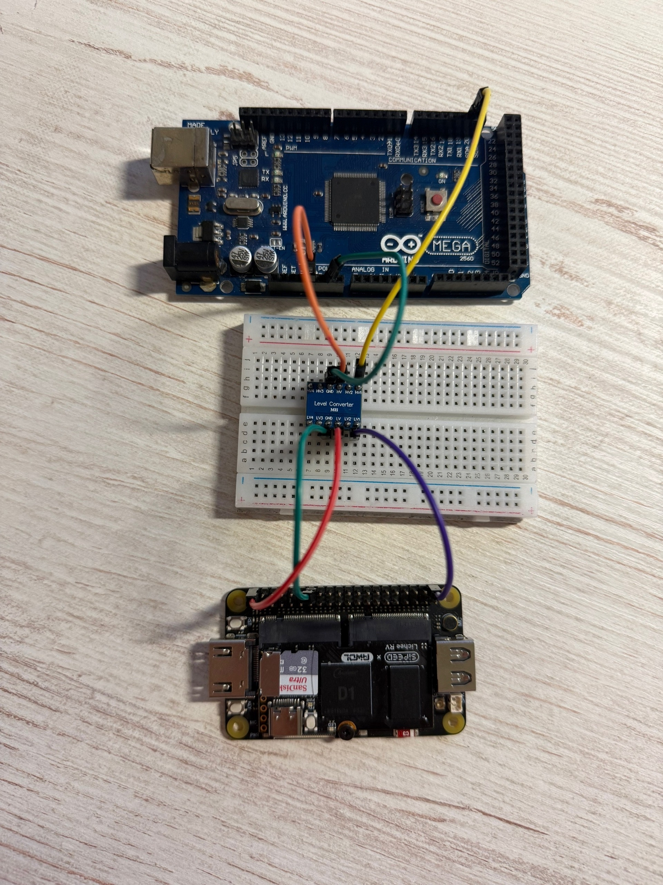

# Лабораторная №11. Основы программирования микроконтроллеров Arduino. Часть 1.

## Цель работы

Освоить базовые принципы программирования микроконтроллеров на примере платформы Arduino. Понять ключевые отличия программирования "чистого железа" от разработки под операционную систему. Научиться создавать простые программы для управления светодиодами и обработки внешних прерываний, а также интегрировать Arduino с одноплатником для совместной работы.

## Подготовительный материал

### Что такое Arduino?

Arduino — это открытая платформа для прототипирования электронных устройств, основанная на простой в использовании аппаратной и программной среде. По сути, это микроконтроллерный комплект, который позволяет быстро создавать электронные проекты без глубоких знаний в электронике.

**Ключевые особенности Arduino:**
- **Микроконтроллер** — "мозг" платы (чаще всего ATmega328P)
- **Программная оболочка** — упрощённая среда разработки (Arduino IDE)
- **Стандартизированные разъёмы** — для подключения периферии
- **Открытая архитектура** — возможность модификации и клонирования

### Программирование "чистого железа" vs разработка под ОС

**Ключевые особенности Arduino:**

Программирование микроконтроллеров, таких как Arduino, принципиально отличается от разработки под операционные системы. В Arduino отсутствует операционная система — программа работает напрямую с аппаратным обеспечением, что обеспечивает прямой доступ к регистрам периферийных устройств. Это позволяет управлять оборудованием на самом низком уровне, но требует от разработчика глубокого понимания архитектуры микроконтроллера.

Одним из важных преимуществ программирования микроконтроллеров является детерминированное выполнение операций — время выполнения каждой инструкции известно точно, что критически важно для систем реального времени. Однако это достигается за счёт ограниченных ресурсов: микроконтроллеры имеют мало памяти (обычно килобайты) и работают на сравнительно низких частотах процессора (мегагерцы вместо гигагерц).

Программа для Arduino называется прошивкой (firmware) — она загружается в память микроконтроллера один раз и работает постоянно, в отличие от программ для операционных систем, которые запускаются и останавливаются по необходимости.

**В отличие от этого, разработка под операционную систему, как на Lichee RV Dock, происходит на другом уровне абстракции.** Здесь программа работает поверх ядра Linux, которое предоставляет абстракцию оборудования через драйверы и системные вызовы. Это упрощает разработку, но добавляет накладные расходы. Операционная система обеспечивает многозадачность — несколько программ могут работать одновременно, разделяя ресурсы процессора. Системы с ОС обычно имеют значительно большие ресурсы: больше памяти, более высокую производительность процессора и развитую файловую систему. Программа в таком контексте представляет собой исполняемый файл, который можно запускать и останавливать по мере необходимости.

### Архитектура микроконтроллера ATmega328P

Arduino Uno основана на микроконтроллере ATmega328P:
- **Тактовая частота**: 16 МГц
- **Флэш-память**: 32 КБ (для программы)
- **ОЗУ**: 2 КБ (для данных)
- **Энергонезависимая память**: 1 КБ EEPROM
- **Периферия**: таймеры, АЦП, UART, SPI, I2C, GPIO

### Как заливается прошивка в Arduino?

Процесс программирования Arduino состоит из нескольких этапов. Сначала разработчик пишет код в среде Arduino IDE, используя упрощённый диалект C/C++ с готовыми библиотеками для работы с периферией. Затем среда разработки компилирует код в машинные инструкции для архитектуры AVR, оптимизируя его под ограниченные ресурсы микроконтроллера. 

После компиляции происходит загрузка прошивки через USB-порт с использованием встроенного программатора. Как только прошивка успешно загружена, программа начинает выполняться сразу же — микроконтроллер переходит к выполнению кода без необходимости перезагрузки или дополнительных действий.

**Загрузчик (bootloader)** играет ключевую роль в этом процессе. Это специальная программа, которая постоянно находится в защищённой области памяти микроконтроллера. 

При включении Arduino загрузчик первым делом проверяет, не поступила ли команда на загрузку новой прошивки. Если такой команды нет, он просто передаёт управление основной программе. Если же пользователь пытается загрузить новый скетч, загрузчик активирует режим программирования: он принимает данные через последовательный порт (UART), проверяет их целостность, и записывает во флэш-память микроконтроллера. После успешной записи загрузчик выполняет верификацию — сравнивает записанные данные с полученными, и только затем запускает новую программу. Эта система позволяет программировать Arduino без использования внешних программаторов, что значительно упрощает процесс разработки и отладки.

### Основные концепции программирования Arduino

**Скетч (sketch)** — так называется программа для Arduino. Каждый скетч состоит из двух обязательных функций:

```cpp
void setup() {
  // Выполняется один раз при старте
  // Инициализация пинов, настройка периферии
}

void loop() {
  // Выполняется бесконечно в цикле
  // Основная логика программы
}
```

**Цифровые входы/выходы (GPIO)** — пины общего назначения, которые могут работать в разных режимах, задаваемых функцией `pinMode()`. Базовые режимы:

- **OUTPUT** — пин работает как выход: микроконтроллер управляет напряжением на пине (HIGH — 5 В или LOW — 0 В) для управления светодиодами, реле и другими устройствами
- **INPUT** — пин работает как вход: микроконтроллер считывает внешний сигнал (HIGH или LOW) от кнопок, датчиков и других схем

Помимо базовых, существуют дополнительные режимы, которые настраивают внутренние резисторы микроконтроллера:

- **INPUT_PULLUP** — вход с подтяжкой к питанию. Внутренний резистор (около 20–50 кОм) подтягивает пин к высокому уровню (HIGH). Когда внешнее устройство (например, кнопка) соединяет пин с землёй, читается LOW. Этот режим удобен для кнопок и контактов — не нужен внешний резистор, а по умолчанию пин всегда находится в известном (высоком) состоянии
- **INPUT_PULLDOWN** — вход с подтяжкой к земле (доступен не на всех пинах Arduino Uno, только на некоторых моделях микроконтроллеров). Пин подтягивается к LOW, а внешний сигнал переводит его в HIGH. На ATmega328P этот режим обычно недоступен через `pinMode()` — для подтяжки к земле используется внешний резистор или подтяжка к питанию с инвертированием логики

**Прерывания (interrupts)** — это важнейший механизм в программировании микроконтроллеров, который позволяет процессору реагировать на внешние или внутренние события практически мгновенно, не тратя время на постоянную проверку состояния в основном цикле программы. Когда происходит событие, на которое настроено прерывание, микроконтроллер приостанавливает выполнение текущего кода, сохраняет его контекст (содержимое регистров и счётчик команд), и немедленно переходит к специальной функции-обработчику. После завершения обработчика микроконтроллер восстанавливает контекст и продолжает выполнение с того же места, где остановился.

Различают два основных типа прерываний. **Аппаратные прерывания** возникают от внешних устройств и периферии микроконтроллера — сигналов на цифровых пинах, таймеров, UART, SPI, I2C и других коммуникационных интерфейсов. **Программные прерывания** инициируются самим кодом через специальные инструкции процессора — они используются для вызова функций операционной системы или приоритетного переключения задач.

**Режимы срабатывания аппаратных прерываний:** При настройке внешнего прерывания на пине можно выбрать один из четырёх режимов:
- **LOW** — прерывание срабатывает постоянно, пока на пине низкий уровень
- **CHANGE** — прерывание срабатывает при любом изменении сигнала (с HIGH на LOW и наоборот)
- **RISING** — прерывание срабатывает только при переходе с LOW на HIGH (восходящий фронт)
- **FALLING** — прерывание срабатывает только при переходе с HIGH на LOW (нисходящий фронт)

**Особенности работы с прерываниями в Arduino на ATmega328P:**
- Прерывания доступны только на пинах 2 и 3 (для Arduino Uno на ATmega328P)
- Обработчик прерывания должен выполняться максимально быстро, чтобы не блокировать основную программу
- Внутри обработчика прерывания не рекомендуется использовать функции вроде `delay()`, `Serial.print()` и другие, которые могут зависнуть
- Переменные, используемые внутри обработчика и в основном цикле, должны объявляться с ключевым словом `volatile`, чтобы компилятор не оптимизировал их хранение в регистрах процессора вместо памяти

## Практическая часть

### Подготовка необходимого оборудования

1. **Arduino Uno** — подключите к компьютеру через USB
2. **Светодиодная мезонинная плата** — вставляется в соответствии с распиновкой Arduino
3. **Соединительные перемычки** — для соединения оборудования
4. **Lichee RV Dock** — с программой генерации меандра на выводе GPIO 144 из лабораторной №10
5. **Преобразователь логических уровней** размещенный на макетной плате

### Установка и настройка Arduino IDE

1. Скачайте Arduino IDE из репозитория, путем установки пакета *arduino*
2. Выберите правильную плату: **Инструменты → Плата → Arduino Uno**
3. Выберите правильный порт: **Инструменты → Порт** (например, COM3 или /dev/ttyUSB0)

### Первая программа — "Моргающий светодиод"

Создайте новый скетч и напишите простейшую программу:

```cpp
// Подключение светодиода к пину 13

void setup() {
  // Настройка пина как выхода
  pinMode(LED_BUILTIN, OUTPUT);
}

void loop() {
  // Включить светодиод
  digitalWrite(LED_BUILTIN, HIGH);
  delay(1000);  // Ждать 1 секунду
  
  // Выключить светодиод
  digitalWrite(LED_BUILTIN, LOW);
  delay(1000);  // Ждать 1 секунду
}
```

**Что происходит:**
- `pinMode()` — настраивает пин как вход или выход
- `digitalWrite()` — устанавливает высокий (5В) или низкий (0В) уровень напряжения на пинах микроконтроллера
- `delay()` — приостанавливает выполнение на указанное время (в миллисекундах)


### Работа с прерываниями

Прерывания позволяют Arduino реагировать на внешние события без постоянной проверки в основном цикле.

**Пины 2 и 3 на Arduino Uno** могут быть использованы для работы с аппаратными прерываниями.


**Программа с прерыванием:**

```cpp
// Пин для прерывания (порт 2 поддерживает прерывание INT0)
#define INTERRUPT_PIN 2

// Пин для светодиода
#define LED_PIN 5

// Счётчик прерываний
volatile int interruptCounter = 0;

void setup() {
  // Настройка пина светодиода
  pinMode(LED_PIN, OUTPUT);
  
  // Настройка пина прерывания как входа
  pinMode(INTERRUPT_PIN, INPUT);
  
  // Настройка прерывания:
  // - Пин: INTERRUPT_PIN (2)
  // - Функция обработки: handleInterrupt
  // - Режим: FALLING (срабатывает при переходе с HIGH на LOW)
  // Функция digitalPinToInterrupt преобразует номер пина в номер прерывания на нем

  // Таким образом пользовательская функция handleInterrupt привязывается к прерыванию
  // на пине INTERRUPT_PIN в режиме FALLING
  attachInterrupt(digitalPinToInterrupt(INTERRUPT_PIN), handleInterrupt, FALLING);
  
  // Инициализация последовательного порта для отладки
  Serial.begin(115200);
  Serial.println("Arduino готов к работе");
  Serial.println("Ожидание прерываний от Lichee...");
}

void loop() {
  // Основной цикл может выполнять другие задачи
  digitalWrite(LED_PIN, HIGH);
  delay(500);
  digitalWrite(LED_PIN, LOW);
  delay(500);
  
  // Вывод счётчика прерываний
  static int lastCount = 0;
  if (interruptCounter != lastCount) {
    Serial.print("Получено прерываний: ");
    Serial.println(interruptCounter);
    lastCount = interruptCounter;
  }
}

// Функция обработки прерывания
void handleInterrupt() {
  interruptCounter++;  // Увеличиваем счётчик
}
```

## Задание

Ознакомившись с подготовительным материалом,**протестировав и разобравшись в работе элементарных программ** решить следующие подзадачи:

### Программа "Светофор"

Создайте программу, имитирующую бегущий огонек на мезонинной плате, путем "мигания" светодиодами, соединенными с пинами 3,5,6,9 и 10. Огонек должен бежать от 3 пина к 10 и обратно, минуя пины, которые не соединены со светодиодами.

### Программа "Повторитель меандра"

На Lichee RV Dock запустите программу для генерации меандра из лабороторной № 10.

Соедините через логический преобразователь уровней пины в следующем соответствии:

- Arduino pin GND → GND пины на преобразователe → Lichee pin GND
- Lichee pin GPIO 144 → LV1/HV1 пин на преобразователе → Arduino pin 2
- Lichee pin 3.3 V → LV/HV пин на преобразователе → Arduino pin 5 V

Преобразователь логических уровней — это схема, которая согласует разные напряжения питания логических сигналов (например, 3.3 В и 5 В), чтобы устройства могли корректно обмениваться данными без повреждения выводов.

Преобразователь в данном случае нужен, чтобы понизить 5 В от Arduino до безопасных 3.3 В для Lichee.



**Пример подключения устройств**

Затем, напишите программу, которая на пине 4 повторяет генерируемый на Lichee меандр, работая с прерыванием на пине №2 в режиме CHANGE.

#### Анализ сигналов логическим анализатором 

Используя навык работы с логическим анализатором из лабораторной №10, проанализируйте сигналы:

1. **Подключите логический анализатор** к пину GPIO 144 на Lichee и пину 4 на Arduino
2. **Запустите PulseView**
3. **Наблюдайте прерывания** — сигналы от Lichee RV Dock
4. Убедитесь в корректности работы программы для Arduino
5. **Измерьте временные параметры** — длительность импульсов, интервалы,и временную разницу между фронтами сигналов

### Демонстрация и отчёт

- **Продемонстрировать работу преподавателю**
- Сформировать отчёт о выполнении поставленных задач .doc и **выслать на почту преподавателя до обозначенного срока**

