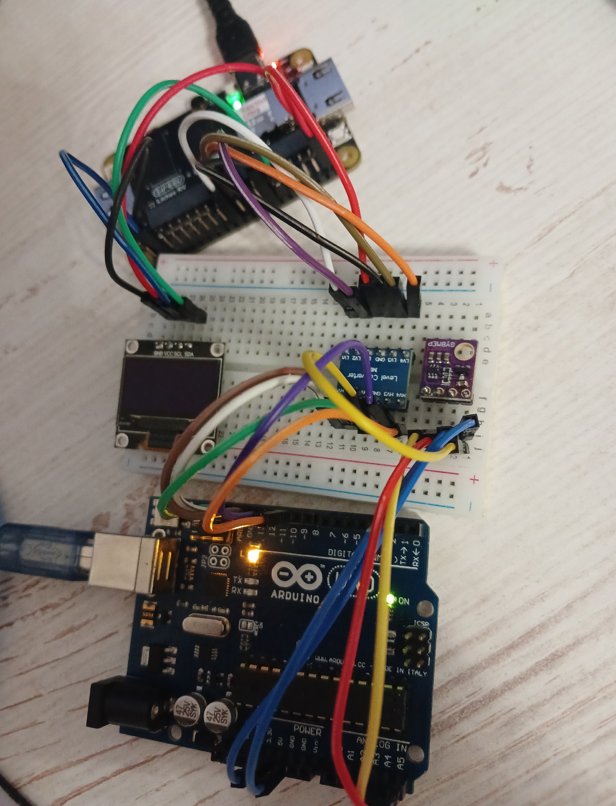

# Лабораторная №12. Интеграция Arduino и Lichee RV Dock по SPI с датчиком BME280

## Цель работы

Освоить совместную работу одноплатного компьютера Lichee RV Dock и микроконтроллера Arduino Uno в единой распределённой системе. Научиться считывать данные с датчика BME280 по I2C на Arduino, передавать их на Lichee через SPI-интерфейс и отображать на OLED-экране по I2C — тем самым объединяя знания и навыки, полученные в лабораторных №7 (SPI), №9 (I2C, OLED) и №11 (Arduino).

## Подготовительный материал

### Архитектура системы

```
┌──────────┐   I2C    ┌─────────┐   SPI    ┌────────────────┐   I2C   ┌──────────┐
│  BME280  │─────────▶│ Arduino │────────▶│ Lichee RV Dock │───────▶│ SSD-1306 │
│  датчик   │  (SDA/A4 │  Uno    │ (12-один-│   (мастер)     │ (PE12, │  OLED    │
│ (I2C 0x76)│   SCL/A5)│ (слейв) │  байтовые│                │  PE13) │ (0x3C)  │
└──────────┘          └─────────┘ транз-ции)└────────────────┘        └──────────┘
```

Архитектура объединяет три интерфейса и два вычислительных устройства:

1. **Arduino → BME280 (I2C)** — чтение температуры, влажности и давления с датчика
2. **Arduino → Lichee (SPI)** — передача собранных данных на одноплатник; Arduino работает как SPI-ведомый (slave)
3. **Lichee → OLED (I2C)** — отображение полученных данных на экране SSD-1306 (лабораторная №9)

Передача по SPI выполняется серией из 12 однобайтовых транзакций — по одной на каждый байт трёх чисел формата `float`. Такой подход выбран потому, что AVR-микроконтроллер ATmega328P в режиме SPI-slave имеет однобайтовый буфер передачи: при непрерывном тактировании нескольких байт (burst) shift register не перезагружается из буфера SPDR автоматически. Использование 12 отдельных транзакций (SS↓→1 байт→SS↑) гарантирует перезагрузку shift register из SPDR в начале каждой из них.

### Датчик BME280 и библиотека GyverBME280

BME280 — цифровой датчик температуры, влажности и атмосферного давления производства Bosch Sensortec. Поддерживает интерфейсы I2C и SPI; в данной работе используется **I2C** как наиболее удобный для подключения к Arduino.

**Характеристики:**
- Диапазон температур: от −40 до +85°C, точность ±0.5°C
- Диапазон влажности: от 0 до 100%, точность ±3%
- Диапазон давления: от 300 до 1100 гПа, точность ±1 гПа
- Напряжение питания: 1.8–3.6 В
- I2C-адрес по умолчанию: **0x76** (вывод SDO замкнут на GND)

**Подключение BME280 к Arduino:**

```
BME280      Arduino Uno
------      -----------
VCC    →    3.3V
GND    →    GND
SDA    →    A4 (SDA)
SCL    →    A5 (SCL)
```

**Библиотека GyverBME280**

В отличие от громоздкой Adafruit BME280 (требует Adafruit Sensor, Adafruit BusIO и пр.), GyverBME280 — лёгкая библиотека, занимающая минимум памяти и не требующая дополнительных зависимостей. Установка через менеджер библиотек Arduino IDE: «GyverBME280».

Основные методы:

```cpp
#include <GyverBME280.h>
GyverBME280 bme;

bme.begin();                    // инициализация (I2C-адрес 0x76 по умолчанию)
bme.readTemperature();          // температура в °C (float)
bme.readHumidity();             // влажность в % (float)
bme.readPressure();             // давление в Па (float), для гПа разделить на 100
```

Простой пример чтения датчика:

```cpp
#include <GyverBME280.h>
GyverBME280 bme;

void setup() {
  Serial.begin(115200);
  Wire.begin();
  if (bme.begin()) {
    Serial.println("BME280 OK");
  } else {
    Serial.println("ERROR: BME280 not found!");
  }
}

void loop() {
  Serial.print("T: ");   Serial.print(bme.readTemperature(), 1);
  Serial.print(" C  H: "); Serial.print(bme.readHumidity(), 1);
  Serial.print(" %  P: "); Serial.println(bme.readPressure() / 100.0, 1);
  delay(1000);
}
```

### SPI-обмен на Arduino в режиме Slave

#### Аппаратная организация SPI

Arduino Uno построена на микроконтроллере ATmega328P, который имеет аппаратный модуль SPI. Контакты:

| Функция | Пин Arduino Uno | В slave режиме |
|---------|----------------|---------------------|
| SS   (Slave Select) | 10 | вход (LOW активирует слейв) |
| MOSI (Master Out Slave In) | 11 | вход |
| MISO (Master In Slave Out) | 12 | выход |
| SCK  (Serial Clock) | 13 | вход |

В режиме слейва Arduino не генерирует тактовый сигнал — SCK приходит от мастера (Lichee). Сигнал SS, опущенный в LOW, активирует слейв и сообщает ему о начале транзакции. По фронтам SCK происходит одновременный сдвиг битов: мастер выставляет бит на MOSI, слейв — на MISO.

#### Регистры SPI

Работа модуля SPI определяется тремя регистрами:

**SPCR (SPI Control Register):**

| Бит | Имя   | Назначение |
|-----|-------|------------|
| 7   | SPIE  | SPI Interrupt Enable — разрешение прерывания по завершению передачи байта |
| 6   | SPE   | SPI Enable — включение модуля SPI |
| 5   | DORD  | Data Order: 0=MSB first, 1=LSB first |
| 4   | MSTR  | Master/Slave Select: 0=Slave, 1=Master |
| 3   | CPOL  | Clock Polarity: 0=SCK в покое LOW |
| 2   | CPHA  | Clock Phase: 0=захват по переднему фронту |
| 1–0 | SPR   | Clock Rate (только для мастера) |

Для включения слейва с прерываниями (SPI mode 0):

```cpp
SPCR = _BV(SPE) | _BV(SPIE);   // 0b11000000: SPI вкл, прерывания вкл, mode 0
```

**SPSR (SPI Status Register):** бит SPIF (7) устанавливается аппаратно по завершению передачи байта. Чтение SPSR, а затем чтение/запись SPDR сбрасывает SPIF.

**SPDR (SPI Data Register):** буфер передаваемых/принимаемых данных. Запись в SPDR помещает байт в буфер передачи; он будет передан при следующей транзакции. Чтение SPDR возвращает последний принятый байт.

#### Прерывание SPI_STC_vect

Когда байт полностью передан (8 тактов SCK), аппаратно устанавливается флаг SPIF, и если бит SPIE в SPCR равен 1, генерируется прерывание. Обработчик помечается макросом `ISR(SPI_STC_vect)`.

Ключевой момент для слейва: **до начала следующей однобайтовой транзакции** (пока мастер не опустил SS в LOW) необходимо записать в SPDR байт, который должен быть отправлен мастеру. Если мастер поднимет SS, а затем опустит снова — shift register загрузит содержимое SPDR заново.

**Почему не multibyte burst?**

В AVR-слейве при непрерывной передаче 12 байт без поднятия SS между ними shift register **не перезагружается** из SPDR. После первого байта он заполняется собственным содержимым (по кругу), и мастер получает 12 копий первого байта. Решение — 12 отдельных однобайтовых транзакций с поднятием SS между ними.

#### Базовый пример SPI-slave

Минимальный скетч, отвечающий мастеру фиксированным байтом:

```cpp
#include <SPI.h>

volatile byte g_response = 0xA5;

ISR(SPI_STC_vect) {
  (void)SPDR;            // чтение принятого байта (сброс SPIF)
  SPDR = g_response;     // подготовка ответа на следующую транзакцию
}

void setup() {
  Serial.begin(115200);
  pinMode(SS,   INPUT_PULLUP);
  pinMode(SCK,  INPUT);
  pinMode(MOSI, INPUT);
  pinMode(MISO, OUTPUT);
  SPCR = _BV(SPE) | _BV(SPIE);
  sei();
  SPDR = g_response;     // предзагрузка первого байта
  Serial.println("SPI slave ready");
}

void loop() {
  // прерывание делает всю работу
}
```

**Пояснение:**
- `pinMode(SS, INPUT_PULLUP)` — встроенная подтяжка к HIGH, чтобы SS не плавало и не активировало слейв ложно
- `SPCR = _BV(SPE) | _BV(SPIE)` — включение SPI в режиме слейва с прерываниями (MSTR=0 по умолчанию)
- `sei()` — глобальное разрешение прерываний
- `SPDR = g_response` — предзагрузка первого ответного байта до того, как мастер начнёт первую транзакцию. Без этого первый байт будет случайным
- В ISR: чтение SPDR (обязательно для сброса SPIF!), затем запись следующего ответного байта

### SPI на Lichee RV Dock

Краткое напоминание: для работы SPI на Lichee необходимо:

1. Ядро с поддержкой `SPI_SUN6I`, `DMA_SUN6I`, `SPI_SPIDEV`
2. Device Tree с активированным `&spi1` на пинах PD10–PD15
3. Устройство `/dev/spidev0.0` (проверить: `ls -la /dev/spidev*`)

Подробная процедура настройки описана в лабораторной №7. Распиновку Lichee RV Dock.

**Пины SPI1 на Lichee RV Dock:**

| Сигнал | Пин Lichee | GPIO |
|--------|-----------|------|
| CS     | —         | PD10 |
| SCK    | —         | PD11 |
| MOSI   | —         | PD12 |
| MISO   | —         | PD13 |

**Python-библиотека spidev:**

```python
import spidev

spi = spidev.SpiDev()
spi.open(bus=0, device=0)      # /dev/spidev0.0
spi.max_speed_hz = 1000000      # 1 МГц
spi.mode = 0                    # CPOL=0, CPHA=0

rx = spi.xfer2([0x00])[0]       # отправить один байт, получить ответ
spi.close()
```

`xfer2()` управляет сигналом CS автоматически: опускает его перед передачей и поднимает после. Это критически важно для нашего протокола из 12 однобайтовых транзакций.

### I2C OLED SSD-1306 на Lichee (лабораторная №9)

Дисплей SSD-1306 — монохромный OLED 128×64 пикселя с I2C-интерфейсом. Подробная процедура настройки I2C на Lichee описана в лабораторной №9.

**Подключение:**

```
SSD1306          Lichee RV Dock
-------          --------------
VCC    →         3.3V (или 5V)
GND    →         GND
SCL    →         TWI2_SCL (PE12)
SDA    →         TWI2_SDA (PE13)
```

**I2C-адрес:** 0x3C (стандартный для SSD-1306).

**Проверка:** `ls -la /dev/i2c-*`

**Python-библиотека luma-oled:**

```python
from luma.core.interface.serial import i2c
from luma.oled.device import ssd1306
from luma.core.render import canvas
from PIL import ImageFont

serial = i2c(port=2, address=0x3C)
oled = ssd1306(serial)
font  = ImageFont.truetype("/usr/share/fonts/truetype/dejavu/DejaVuSans.ttf", 14)

with canvas(oled) as draw:
    draw.text((0, 0),  "Hello!", fill="white", font=font)
```

### Согласование логических уровней

Arduino Uno работает от 5 В, Lichee RV Dock — от 3.3 В. Прямое соединение линий данных недопустимо: 5 В на входе Lichee может вывести GPIO-пины Allwinner D1 из строя.

Для согласования используется **логический преобразователь уровней** на макетной плате. Принцип работы: двунаправленный параллельный преобразователь на MOSFET-транзисторах, у которого каждая пара каналов имеет сторону HV (high voltage, 5 В) и LV (low voltage, 3.3 В).

**Питание преобразователя:**

| Вывод преобразователя | Подключить к           |
|-----------------------|------------------------|
| HV                    | Arduino 5V             |
| LV                    | Lichee 3.3V            |
| GND                   | Общий GND (Arduino + Lichee) |

**Направления сигналов:**

| Сигнал | Направление        | Подключение Arduino | Подключение Lichee |
|--------|--------------------|--------------------|--------------------|
| MOSI   | Lichee → Arduino   | HV (выход в Arduino)| LV (вход с Lichee) |
| SCK    | Lichee → Arduino   | HV                  | LV                 |
| SS     | Lichee → Arduino   | HV                  | LV                 |
| MISO   | Arduino → Lichee   | HV (вход с Arduino) | LV (выход в Lichee)|

Обратите внимание: для сигналов, идущих от Lichee к Arduino (MOSI, SCK, SS), задействована сторона LV как вход, HV как выход. Для сигнала MISO (Arduino → Lichee) — наоборот: HV как вход, LV как выход.

**Полная схема соединений:**

```
BME280           Arduino Uno
------           -----------
VCC  ──────────→ 3.3V
GND  ──────────→ GND
SDA  ──────────→ A4
SCL  ──────────→ A5

Arduino Uno      Конвертер (HV)    Конвертер (LV)      Lichee RV Dock
-----------      --------------    --------------      --------------
MISO (12) ─────→ HV1             → LV1 ──────────────→ MISO (PD13)
MOSI (11) ←───── HV2             ← LV2 ──────────────← MOSI (PD12)
SCK  (13) ←───── HV3             ← LV3 ──────────────← SCK  (PD11)
SS   (10) ←───── HV4             ← LV4 ──────────────← CS   (PD10)

Питание конвертера:
Arduino 5V  ────→ HV
Lichee 3.3V ────→ LV
Arduino GND ────→ GND  ←── Lichee GND

SSD-1306 OLED     Lichee RV Dock
-------------     --------------
VCC ────────────→ 3.3V (или 5V)
GND ────────────→ GND
SDA ────────────→ TWI2_SDA (PE13)
SCL ────────────→ TWI2_SCL (PE12)
```

**Важно:** все GND (Arduino, Lichee, конвертер) должны быть соединены в одну общую точку — без этого сигналы не будут иметь общего уровня отсчёта и SPI не заработает.

**Частая ошибка:** путать MOSI и MISO при соединении. Правило простое — одноимённые пины соединяются друг с другом: MOSI↔MOSI, MISO↔MISO. НЕ перекрещивать!

### Отладка логическим анализатором

Для проверки корректности SPI-обмена рекомендуется использовать логический анализатор (fx2lafw) и программу PulseView (лабораторная №10).

**Подключение анализатора** (рекомендуется к пинам Lichee — все сигналы 3.3 В, безопасно для fx2lafw):

| Канал анализатора | Пин Lichee | Сигнал |
|-------------------|-----------|--------|
| D0 | PD10 | CS |
| D1 | PD11 | SCK |
| D2 | PD12 | MOSI |
| D3 | PD13 | MISO |
| GND | GND | земля |

**Настройка PulseView:**

1. Частота дискретизации: **12 МГц** (минимум 4× к частоте SPI; при 1 МГц SPI желательно 8–12 МГц)
2. Лимит семплов: 1–2M
3. Добавить декодер: `Add protocol decoder → SPI`
4. Привязать каналы: **CS#** = D0, **SCK** = D1, **MOSI** = D2, **MISO** = D3
5. Параметры декодера:
   - CS# polarity: **Active low**
   - CPOL: **0** (SCK в покое LOW)
   - CPHA: **0** (захват по переднему/rising фронту)
   - Bit order: **MSB first**
   - Wordsize: **8 bits**

**Что должно быть видно на экране:**

При работающей системе (Python-скрипт на Lichee запущен) каждые 2 секунды появится серия из 12 SPI-транзакций. Каждая транзакция: CS падает в LOW на ~8 мкс, 8 тактов SCK с периодом ~1 мкс, CS поднимается в HIGH. MOSI — все биты равны 0 (Python шлёт `0x00`). MISO — биты, соответствующие данным датчика (каждый байт разный, в отличие от MOSI).

## Практическая часть

### Шаг 0: Подготовка оборудования

Убедитесь, что:

- **Lichee RV Dock:** настроен SPI (лабораторная №7), настроен I2C (лабораторная №9)
- Присутствуют файлы устройств:
  ```bash
  $ ls -la /dev/spidev*
  $ ls -la /dev/i2c-*
  ```
- Установлены Python-библиотеки:
  ```bash
  # apt-get install python3-spidev python3-module-luma-oled
  ```
- **Arduino Uno:** подключена к компьютеру, Arduino IDE установлена (`apt-get install arduino`)
- В менеджере библиотек Arduino IDE установлена **GyverBME280**

### Шаг 1: Проверка датчика BME280

Соберите часть схемы: подключите BME280 к Arduino (VCC→3.3V, GND→GND, SDA→A4, SCL→A5).

Загрузите тестовый скетч в Arduino:

```cpp
#include <GyverBME280.h>
GyverBME280 bme;

void setup() {
  Serial.begin(115200);
  Wire.begin();

  if (bme.begin()) {
    Serial.println("BME280 OK (I2C 0x76)");
  } else {
    Serial.println("ERROR: BME280 not found!");
    Serial.println("Check SDA(A4), SCL(A5), 3.3V, GND.");
    while (1);
  }
}

void loop() {
  float t = bme.readTemperature();
  float h = bme.readHumidity();
  float p = bme.readPressure() / 100.0;

  Serial.print("T: "); Serial.print(t, 1);
  Serial.print(" C  H: "); Serial.print(h, 1);
  Serial.print(" %  P: "); Serial.println(p, 1);

  delay(1000);
}
```

Откройте **Инструменты → Монитор порта** (115200 бод). Если датчик подключён правильно, вы увидите показания температуры, влажности и давления. Если ошибка — проверьте подключение (особенно контакты SDA/SCL и питание 3.3V).

### Шаг 2: Проверка SPI-соединения

На этом шаге мы убедимся, что SPI-обмен между Arduino и Lichee работает. Arduino будет отвечать фиксированным байтом, Python на Lichee — читать его.

**2a. Скетч для Arduino**

```cpp
#include <SPI.h>

volatile bool g_done = false;

ISR(SPI_STC_vect) {
  (void)SPDR;            // читаем принятый байт
  g_done = true;
}

void setup() {
  Serial.begin(115200);
  delay(500);

  pinMode(SS,   INPUT_PULLUP);
  pinMode(SCK,  INPUT);
  pinMode(MOSI, INPUT);
  pinMode(MISO, OUTPUT);

  SPCR = _BV(SPE) | _BV(SPIE);
  sei();

  SPDR = 0xA5;           // предзагрузка первого байта

  Serial.println("SPI slave ready. Sending 0xA5.");
}

void loop() {
  if (g_done) {
    SPDR = 0xA5;         // подготовка ответа на следующую транзакцию
    g_done = false;

    static bool led = false;
    led = !led;
    digitalWrite(LED_BUILTIN, led);
  }
}
```

Загрузите скетч. Светодиод `L` на плате Arduino должен начать мигать при каждом SPI-запросе.

**2b. Тестовый Python-скрипт на Lichee** (`test_spi.py`):

```python
#!/usr/bin/env python3
import spidev, time

spi = spidev.SpiDev()
spi.open(0, 0)                 # /dev/spidev1.0
spi.max_speed_hz = 100000
spi.mode = 0

print("SPI test: Ctrl+C to stop")
try:
    while True:
        rx = spi.xfer2([0x00])[0]
        print(f"RX: {rx:02X} (0x{rx:02X})")
        time.sleep(0.5)
except KeyboardInterrupt:
    spi.close()
    print("Done.")
```

Запустите: `python3 test_spi.py`. Если SPI работает, вы увидите `RX: A5` — Arduino отвечает байтом 0xA5. Если `RX: FF` — проверьте соединения (особенно MISO и общий GND), правильность направлений на конвертере уровней и питание конвертера.
example_connect.jpg
**2c. Отладка логическим анализатором(ОПЦИОНАЛЬНО)**
)
Подключите логический анализатор к пинам Lichee (PD10=D0, PD11=D1, PD12=D2, PD13=D3, GND). Запустите захват в PulseView (12 МГц, 1M семплов) одновременно с тестовым скриптом. Вы должны увидеть:

- CS (D0): короткие импульсы LOW (активный уровень)
- SCK (D1): 8 тактов на каждый CS-импульс
- MOSI (D2): все биты = 0
- MISO (D3): биты = `10100101` (0xA5)


### Шаг 3: Сборка полной схемы

Соберите схему полностью, руководствуясь таблицей соединений из подготовительного материала:

1. Подключите BME280 к Arduino (I2C)
2. Подключите Arduino к конвертеру уровней (SPI)
3. Подключите конвертер к Lichee (SPI)
4. Подайте питание на конвертер: HV = Arduino 5V, LV = Lichee 3.3V
5. Соедините все GND
6. Подключите OLED SSD-1306 к Lichee (I2C)

На рисунке ниже приведен пример такого соединения:




### Шаг 4: Финальные программы

**4a. Итоговый скетч для Arduino** (`arduino_spi_slave.ino`):

```cpp
#include <GyverBME280.h>
#include <SPI.h>

GyverBME280 bme;

volatile float         g_temp   = 0.0;
volatile float         g_hum    = 0.0;
volatile float         g_press  = 0.0;
volatile bool          g_ok     = false;
volatile byte          g_tx[12];
volatile byte          g_txPos  = 0;
volatile byte          g_rxByte = 0;
volatile bool          g_done   = false;
volatile unsigned int  g_cnt    = 0;

ISR(SPI_STC_vect) {
  g_rxByte = SPDR;
  g_done   = true;
  g_cnt++;
}

void buf_load_sensor() {
  float t = g_temp;
  float h = g_hum;
  float p = g_press;

  noInterrupts();
  memcpy((void*)(g_tx + 0), &t, sizeof(float));
  memcpy((void*)(g_tx + 4), &h, sizeof(float));
  memcpy((void*)(g_tx + 8), &p, sizeof(float));
  interrupts();
}

void setup() {
  Serial.begin(115200);
  delay(500);

  pinMode(LED_BUILTIN, OUTPUT);
  Serial.println("Arduino SPI Slave + BME280");
  Serial.println("==========================");

  Wire.begin();
  g_ok = bme.begin();
  Serial.println(g_ok ? "BME280 OK (I2C 0x76)" : "ERROR: BME280 not found!");

  pinMode(SS,   INPUT_PULLUP);
  pinMode(SCK,  INPUT);
  pinMode(MOSI, INPUT);
  pinMode(MISO, OUTPUT);

  SPCR = _BV(SPE) | _BV(SPIE);
  sei();

  buf_load_sensor();
  g_txPos = 0;
  SPDR    = g_tx[0];

  Serial.println("SPI slave ready. Waiting for Lichee master...");
  Serial.println("==============================================");
}

void loop() {
  static uint32_t last = 0;
  uint32_t now = millis();

  if (now - last >= 1000) {
    if (g_ok) {
      g_temp  = bme.readTemperature();
      g_hum   = bme.readHumidity();
      g_press = bme.readPressure() / 100.0;
    }

    Serial.print("T:"); Serial.print(g_temp, 1);
    Serial.print(" H:"); Serial.print(g_hum, 1);
    Serial.print(" P:"); Serial.print(g_press, 1);
    Serial.print(" cnt:"); Serial.println(g_cnt);

    last = now;
  }

  if (g_done) {
    g_txPos++;
    if (g_txPos >= 12) {
      g_txPos = 0;
      buf_load_sensor();
    }
    SPDR    = g_tx[g_txPos];
    g_done  = false;

    digitalWrite(LED_BUILTIN, !digitalRead(LED_BUILTIN));
  }
}
```

**Логика работы:**
- `setup()`: инициализация датчика по I2C, настройка SPI в режиме слейва, предзагрузка первого байта в SPDR
- `loop()`: раз в секунду читает датчик и выводит значения в Serial; при завершении однобайтовой SPI-транзакции (`g_done`) продвигает указатель `g_txPos` и загружает следующий байт в SPDR; после отправки всех 12 байт (3 float) обновляет буфер свежими данными датчика
- `ISR`: сохраняет принятый байт, устанавливает флаг завершения транзакции
- Светодиод `L` мигает при каждой SPI-транзакции — визуальный индикатор обмена

**4b. Итоговый Python-скрипт для Lichee** (`lichee_spi_oled.py`):

```python
#!/usr/bin/env python3

import spidev
import struct
import time
from luma.core.interface.serial import i2c
from luma.oled.device import ssd1306
from luma.core.render import canvas
from PIL import ImageFont

SPI_BUS    = 0
SPI_DEVICE = 0
SPI_SPEED  = 1000000

I2C_PORT   = 0
I2C_ADDR   = 0x3C

UPDATE_INTERVAL = 2.0

try:
    font = ImageFont.truetype(
        "/usr/share/fonts/truetype/dejavu/DejaVuSans.ttf", 14)
except Exception:
    font = ImageFont.load_default()

def main():
    spi = spidev.SpiDev()
    spi.open(SPI_BUS, SPI_DEVICE)
    spi.max_speed_hz = SPI_SPEED
    spi.mode = 0
    print(f"SPI: /dev/spidev{SPI_BUS}.{SPI_DEVICE} @ {SPI_SPEED} Hz")

    serial = i2c(port=I2C_PORT, address=I2C_ADDR)
    oled = ssd1306(serial)
    oled.clear()
    print(f"OLED: I2C-{I2C_PORT}, addr 0x{I2C_ADDR:02X}")

    print("\n" + "=" * 44)
    print("SYSTEM RUNNING")
    print("  BME280 -> Arduino(I2C) -> Lichee(SPI) -> OLED(I2C)")
    print("  Press Ctrl+C to stop")
    print("=" * 44 + "\n")

    try:
        while True:
            rx = [spi.xfer2([0x00])[0] for _ in range(12)]
            data = bytes(rx)
            temp, hum, press = struct.unpack("<fff", data)

            print(f"T: {temp:6.1f} C   "
                  f"H: {hum:5.1f} %   "
                  f"P: {press:7.1f} hPa")

            with canvas(oled) as draw:
                draw.text((0, 0),  f"Temp:  {temp:.1f} C",
                          fill="white", font=font)
                draw.text((0, 20), f"Hum:   {hum:.1f} %",
                          fill="white", font=font)
                draw.text((0, 40), f"Press: {press:.1f} hPa",
                          fill="white", font=font)

            time.sleep(UPDATE_INTERVAL)

    except KeyboardInterrupt:
        print("\nStopped by user.")
    finally:
        oled.clear()
        spi.close()
        print("SPI closed, OLED cleared.")

if __name__ == "__main__":
    main()
```

**Логика работы:**
- Открывает SPI (bus=1, device=0, 1 МГц, mode 0) и I2C OLED (port=2, addr=0x3C)
- В бесконечном цикле выполняет 12 однобайтовых SPI-транзакций (`xfer2([0x00])`)
- Собирает 12 принятых байт, распаковывает как три числа `float` в формате little-endian (`<fff`): температура, влажность, давление
- Выводит значения в консоль и на OLED-экран (три строки, шрифт DejaVuSans 14pt)
- Интервал обновления — 2 секунды
- При нажатии Ctrl+C очищает экран и корректно закрывает SPI

### Шаг 5: Запуск и проверка

1. **Загрузите скетч** `arduino_spi_slave.ino` на Arduino (плата: Arduino Uno, порт: `/dev/ttyUSB0` или аналогичный)
2. **Проверьте Serial-монитор** (115200 бод) — должны появиться сообщения об инициализации BME280 и SPI, а затем показания датчика и счётчик ISR (`cnt:`)
3. **Запустите Python-скрипт** на Lichee:
4. **Убедитесь в корректной работе:**
   - В консоли Lichee: строки `T: ... C  H: ... %  P: ... hPa` с реальными данными
   - На OLED-экране: три строки с температурой, влажностью и давлением
   - На Arduino: светодиод `L` мигает, счётчик ISR растёт
5. **Проверьте логическим анализатором(опционально):** 12 CS-импульсов с 8 тактами SCK каждый, MOSI=0, MISO меняется

## Задание

Ознакомившись с подготовительным материалом, выполните следующие подзадачи:

1. **Проверкить работу датчика.** Подключите BME280 к Arduino по I2C. Напишите скетч, читающий температуру, влажность и давление, и убедитесь в корректности показаний через Serial-монитор.

2. **Проверить SPI-соединениe.** Соберите SPI-цепь (Arduino → конвертер уровней → Lichee). Напишите скетч, отвечающий фиксированным байтом 0xA5, и Python-скрипт на Lichee, читающий этот байт. Добейтесь уверенного приёма. Проверьте сигналы логическим анализатором в PulseView(опционально).

3. **Собрать полную схему.** Руководствуясь таблицей соединений, соберите схему целиком: BME280→Arduino, Arduino→Конвертер→Lichee (SPI), OLED→Lichee (I2C). Обеспечьте общий GND.

4. **Протестировать финальную программу.** Загрузите итоговый скетч в Arduino и запустите Python-скрипт на Lichee. На OLED-экране должны отображаться температура, влажность и давление с датчика BME280.

5. **Ответить на вопросы преподавателя.**

6. **Продемонстрировать работу преподавателю.**

7. Сформировать отчёт о выполнении поставленных задач `.doc` и **выслать на почту преподавателя до обозначенного срока**.