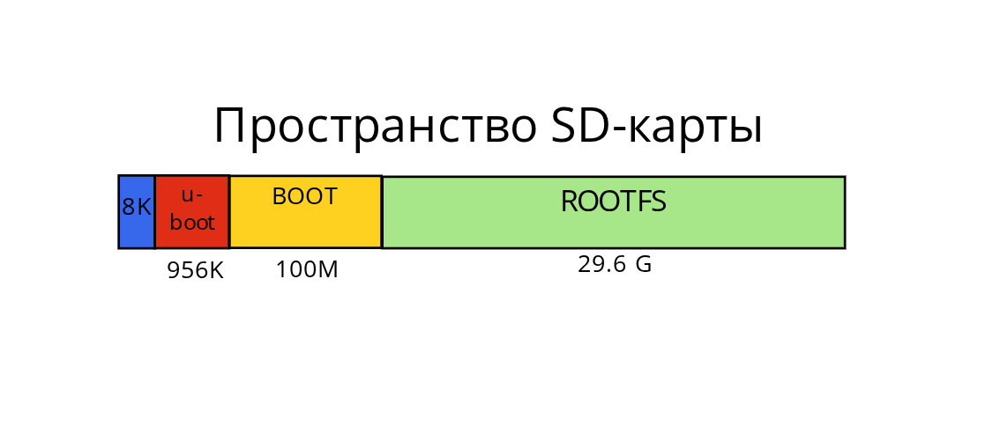

# Лабораторная №6. Подготовка носителя и запись образа на носитель.

## Цель работы

Освоить процесс подготовки загрузочного носителя для одноплатного компьютера, используя готовые компоненты образа Linux.

## Подготовительный материал

## Разбивка SD-карты

После подготовки компонентов можно описать процесс записи образа на sd-карту, заодно заново перечислив все необходимое.

Итак, начнем с того, что предварительно нам нужно будет изменить разбивку sd-карты, если такая присутствует.

Для этого предварительно затрем начало SD-карты нулями, при чем с запасом, чтобы гарантированно уничтожить таблицу разделов(10 МБ для этого вполне достаточно).

```
$ sudo dd if=/dev/zero of=/dev/sdX bs=1M count=10
```

Продолжим. Запустим утилиту fdisk и зададим разбиение на 2 раздела. После чего, я поясню наглядно, чего мы тем самым добились.

```
$ sudo fdisk /dev/sdX
```

```
o               # создаем новую DOS таблицу разделов
n               # новый раздел
p               # primary
1               # номер раздела
2048            # начальный сектор
+100M           # размер 100MB
n               # новый раздел
p               # primary
2               # номер раздела
[Enter]         # начать сразу после первого раздела
+29.6G          # все оставшееся пространство
w               # записать изменения и выйти
```

Далее нужно отформатировать созданные разделы в файловую систему(vfat) и файловую системы ext4 с соответсвующими метками. Выбор файловых систем обусловлен тем, что u-boot "из коробки" работает с файловой системой vfat, а ext4 просто достаточно надежная и подходит для размещения на нем rootfs.
```
$ sudo mkfs.vfat -n BOOT /dev/sdX1

$ sudo mkfs.ext4 -L ROOTFS /dev/sdX2
```

Готово!

Можно проверить результат

```
$ sudo fdisk -l /dev/sdX
```
<a name="write_image_components"></a>

## Запись компонентов образа

Представим схематично, как будет выглядеть финальное пространство sd-карточки. В нашем случае, она на 32 Гб. 



Теперь нужно пояснить, что и куда будет записано. 

### Запись u-boot

Для начала, запишем u-boot в начало карты командой

```
$ sudo dd if=/путь/до/загрузчика/lichee rv dock/u-boot-sunxi-with-spl.bin of=/dev/sdX bs=1k seek=8
```

Таким образом, загрузчик будет записан до начала таблицы разделов, и первоначальный загрузчик платы сможет передать ему управление. Для этого мы специально пропустили с помощью параметра *seek* 8 килобайт памяти от начала пространства карточки. Синим на картинке изображены пропущенные 8K, а красным пространство занимаемое загрузчиком.

В картинке **есть некоторая неточность**, ведь неспроста сначала стиралась а потом заново составлялась **таблица разделов**, которая очевидно присутствует где то на sd-карте. И это действительно так. Между пространством под загрузчик(красный блок) и пространством загрузочного раздела(желтый блок) есть небольшое пространство, в котором и находиться таблица разделов.

### Раздел BOOT

Для начала необходимо заполнить всем необходимым раздел BOOT

Для начала, положим на BOOT самое главное — ядро(или сжатое ядро .gz) с именем Image(или любым другим). **Перейдем в склонированную директорию** и выполним

```
$ cp kernels/Image_6.16_wifi_rt /путь/до/BOOT/Image
```

Далее, положим туда же скомпилированный файл device tree, полученный в результате выполнения лабораторной №4.

```
$ cp dts_and_dtb/sun20i-d1-lichee-rv-dock.dtb /путь/до/BOOT/
```

Далее, нужно взять полученный в результате выполнения лабораторной №5 конфигурационный файл для загрузчика, который сообщит ему, какое ядро запускать, с каким device tree и какими параметрами. Важно разместить этот файл в директории с одноименным названием *extlinux*.

```
$ cp -r extlinux.conf /run/media/username/BOOT/extlinux
```


### Раздел ROOTFS

На этот раздел нам нужно распаковать содержимое, которое полностью соответствует заданной метке раздела. 

Распакуем архив на раздел ROOTFS:

```
$ sudo tar -xJpf /путь/до/rootfs.tar.xz -C  /путь/до_раздела/ROOTFS/
```

Готово! Можно пробовать вставлять sd-карту в разъем одноплатника, перед извлечением кардридера не забудьте про вызов команды **sync**, подключаться к пинам UART с помощью переходника и наблюдать за процессом запуска.

## Задание

Ознакомившись с подготовительным материалом к лабораторным №5 и №6 решить следующие подзадачи:

- Создать полноценный образ Alt Linux из предподготовленных в предыдущей лаборотной работе компонентов
- **Продемонстрировать работу преподавателю**
- Сформировать отчет о выполнении поставленных задач .doc и **выслать на почту преподавателя до обозначенного срока**