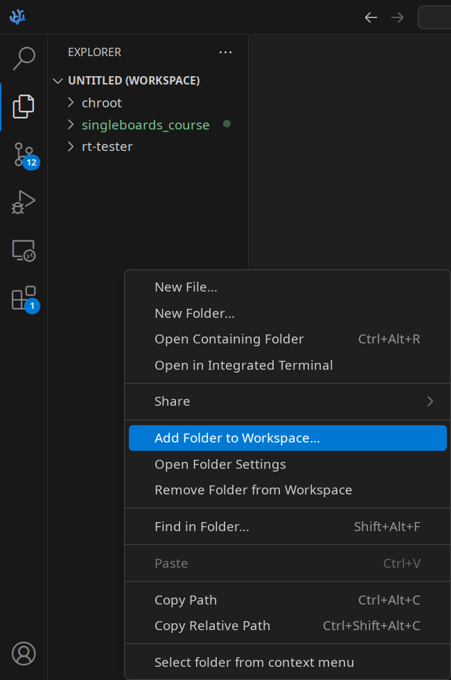

# Лабораторная №8. Разработка и отладка приложений для RISC-V архитектуры. Часть 2.

## Цель работы

Освоить настройку среды разработки для удаленной компиляции и отладки кода, выполняемого на целевом устройстве, а также получить практические навыки использования инструментов изолированной сборки для тестирования программного обеспечения.

## Подготовительный материал

В процессе разработки программного обеспечения для одноплатных компьютеров с архитектурой RISC-V возникает типичная ситуация:

- целевое устройство имеет архитектуру RISC-V и требует нативного выполнения программного кода;

- рабочая станция разработчика базируется на архитектуре x86_64, обеспечивающей комфортные условия для написания кода;

- существует потребность в организации эффективного процесса разработки и отладки.

Данные обстоятельства обуславливают необходимость применения специализированных инструментов и подходов, используемых при разработке кода для различных процессорных архитектур. Независимо от выбранного подхода, общий принцип организации работы остается единым:

- написание исходного кода;

- компиляция с использованием кросс-компилятора;

- перенос исполняемого файла на целевую платформу либо эмуляция целевой платформы;

- выполнение и отладка кода.


### Установка необходимых расширений

Для комфортной работы с C/C++ проектами в VS Code НЕОБХОДИМО установить следующие расширения:

- C/C++ Runner — обеспечивает базовую поддержку языка, подсветку синтаксиса и навигацию по коду
- Open Remote - SSH — для удаленной разработки (потребуется в дальнейшем)


### Удаленная разработка с использованием плагина Remote SSH

Плагин "Remote SSH" для редактора VS Code позволяет организовать удаленную разработку, обеспечивая возможность написания, компиляции и отладки кода непосредственно на целевом устройстве через SSH-соединение.

Для использования данного подхода необходимо:

- установить расширение Remote-SSH в VS Code на хост-машине
- установить и запустить серверную часть плагина на одноплатнике с помощью следующих команд:

```
# 1. Скачивание файла с помощью wget

wget https://github.com/VSCodium/vscodium/releases/download/1.99.32562/vscodium-reh-linux-riscv64-1.99.32562.tar.gz

# 2. Распаковка скачанного tar.gz архива
tar -xzf vscodium-reh-linux-riscv64-1.99.32562.tar.gz

# 3. Запустить скрипт запуска сервера

.vscodium-server/bin/1f9bbd5db96ffb6200c7732948af7aeb7d0773ae/bin/codium-server &
```

#### Подключение к удаленной машине

- Нажмите Ctrl+Shift+P и выберите Remote-SSH: Connect to Host

- Введите строку подключения в формате root@IP-адрес-платы

- При необходимости укажите пароль

После успешного подключения откроется новое окно VS Code с доступом к файловой системе удаленного устройства. Все последующие операции (открытие терминала, установка расширений, запуск задач) будут выполняться на целевой плате.

### Сборка в изолированной среде

При разработке более сложных приложений возникает потребность в использовании дополнительных заголовочных файлов и библиотек, не входящих в стандартную поставку. Кроме того, процесс многократной передачи исполняемых файлов на целевое устройство для тестирования становится неэффективным.

Кроме того для тиражирования приложения на множество устройств необходимо и знать условия и зависимости, при которых приложения будет функциональным. Но при разработке и отладке программы на каком то конрктеном устройстве в конрктеном окружении выявить все внешние условия для работспособности приложения может быть затруднительно.

Эффективным решением данных проблем является применение комбинации двух технологий: hasher и QEMU.

QEMU – эмулятор, обеспечивающий выполнение кода, предназначенного для одной архитектуры процессора, на другой. qemu-user-static – версия QEMU, реализующая исполнение бинарных файлов без полной эмуляции всей системы.

hasher – инструмент безопасной и воспроизводимой сборки пакетов, спроектированный для исключения влияния собираемого пакета на хост-систему и взаимного влияния собираемых пакетов.

В данной схеме qemu-user-static применяется для запуска скомпилированных бинарных файлов, а hasher обеспечивает изолированное окружение, симулирующее файловую систему целевого устройства. Такой подход позволяет тестировать собираемые приложения без передачи на реальное устройство, исключая возможные конфликты во время выполнения.

#### Работа внутри изолированного hasher-окружения

Установка и настройка hasher выполняется согласно [руководству](https://www.altlinux.org/Hasher/%D0%A0%D1%83%D0%BA%D0%BE%D0%B2%D0%BE%D0%B4%D1%81%D1%82%D0%B2%D0%BE). 

Основные этапы включают установку пакета и добавление пользователя в соответствующую группу. Приведем эти шаги:

hasher в Sisyphus и дистрибутивах ALT Linux располагается в пакетах hasher, hasher-priv и легко устанавливается:

```
# apt-get install hasher
```

Кроме того нужно запустить сервис hasher-privd:

```
# systemctl enable --now hasher-privd.service
```

hasher использует специальных вспомогательных пользователей и группу hashman для своей работы, поэтому каждого пользователя, желающего использовать hasher, перед началом работы нужно зарегистрировать:

```
# hasher-useradd имя_пользователя
```

Эта команда создаёт вспомогательных пользователей USER_a и USER_b и добавляет пользователя USER в группы hashman, USER_a и USER_b.

Поскольку hasher-useradd добавляет пользователя в группы, пользователю **необходимо перелогиниться** перед началом работы с hasher.

После установки необходимо создать директорию для сборочной среды:

```
$ mkdir ~/hasher
```

Далее требуется создать конфигурационные файлы для пакетного менеджера. В директории ~/apt создаются файлы riscv64.conf и sources.list.riscv64.

Содержимое riscv64.conf:

```
Dir::Etc::main "/dev/null";
Dir::Etc::parts "/var/empty";
Dir::Etc::SourceParts "/var/empty";
Dir::Etc::sourcelist "/путь/к/домашней/директории/apt/sources.list.riscv";
```
Содержимое sources.list.riscv64:

```
rpm [sisyphus-riscv64] http://ftp.altlinux.org/pub/distributions/ALTLinux/ports/riscv64 Sisyphus/riscv64 classic
rpm [sisyphus-riscv64] http://ftp.altlinux.org/pub/distributions/ALTLinux/ports/riscv64 Sisyphus/noarch classic
```
Создание изолированного окружения с указанием архитектуры и пути к конфигурации:

```
$ hsh --init --target riscv64 --apt-conf ~/apt/riscv64.conf ~/hasher/окружение
```
Установка необходимых пакетов в окружение:

```
$ hsh-install ~/hasher/окружение название-пакета
```

Доступ к окружению для выполнения команд:

```
$ hsh-shell ~/hasher/окружение
```

Отметим, что в дереве каталогов hasher есть каталог *~/hasher/chroot/.in*, в которой **может писать сам пользователь** (а не его двойники, пользователь_a и пользователь_b).

Важным требованием для корректного выполнения RISC-V бинарных файлов является установка переменной окружения QEMU_LD_PREFIX, указывающей на местоположение динамического загрузчика в изолированном окружении.

Это можно сделать путем добавления изменений в файл *~/.bashrc*:

```
echo 'export QEMU_LD_PREFIX=/home/taranev/hasher/chroot/' >> ~/.bashrc
source ~/.bashrc
```

После выполнения всех настроек приложение может быть запущено непосредственно из VS Code и будет выполняться в изолированном окружении с использованием эмуляции QEMU.

#### Настройка редактора VS Code для компиляции и запуска приложений в изолированном окружении

Для того, чтобы поработать в созданном hasher-окружении добавим директорию chroot из hasher окружения в Workspace.



Далее, необходимо перейти в директорию *.in*, в которой может писать и выполнять сам пользователь хостовой системы.

Создадим,для примера, простую программу *test-ncurses.c*, которая с помощью бибилиотеки ncurses печатает разноцветный строки:

```
#include <stdio.h>
#include <ncurses.h>

int main() {
    // Инициализация ncurses
    initscr();
    
    // Проверяем поддержку цветов
    if (has_colors() == FALSE) {
        printw("Ваш терминал не поддерживает цвета\n");
        endwin();
        return 1;
    }
    
    // Включаем поддержку цветов
    start_color();
    
    // Инициализируем цветовые пары
    init_pair(1, COLOR_RED, COLOR_BLACK);
    init_pair(2, COLOR_GREEN, COLOR_BLACK);
    init_pair(3, COLOR_YELLOW, COLOR_BLACK);
    init_pair(4, COLOR_BLUE, COLOR_BLACK);
    init_pair(5, COLOR_MAGENTA, COLOR_BLACK);
    init_pair(6, COLOR_CYAN, COLOR_BLACK);
    
    // Выводим цветной текст
    attron(COLOR_PAIR(1));
    printw("Красный текст\n");
    attroff(COLOR_PAIR(1));
    
    attron(COLOR_PAIR(2));
    printw("Зеленый текст\n");
    attroff(COLOR_PAIR(2));
    
    attron(COLOR_PAIR(3));
    printw("Желтый текст\n");
    attroff(COLOR_PAIR(3));
    
    attron(COLOR_PAIR(4));
    printw("Синий текст\n");
    attroff(COLOR_PAIR(4));
    
    attron(COLOR_PAIR(5));
    printw("Пурпурный текст\n");
    attroff(COLOR_PAIR(5));
    
    attron(COLOR_PAIR(6));
    printw("Голубой текст\n");
    attroff(COLOR_PAIR(6));
    
    // Добавляем простую анимацию
    printw("\nНажмите любую клавишу для анимации...\n");
    getch();
    
    clear();
    for (int i = 0; i < 10; i++) {
        attron(COLOR_PAIR(1));
        mvprintw(5, i, "█");
        attroff(COLOR_PAIR(1));
        
        attron(COLOR_PAIR(2));
        mvprintw(5, 20 - i, "█");
        attroff(COLOR_PAIR(2));
        
        refresh();
        napms(100);
    }
    
    printw("\n\nНажмите любую клавишу для выхода...");
    getch();
    
    // Завершаем работу с ncurses
    endwin();
    return 0;
}
```
Попытка сборки приложения вызовет ошибку, которая может быть вызвана следующими причинами:

- по умолчанию будет вызываться компилятор gcc для x86_64
- библиотека ncurses не линкуется при сборке с объектным файлом
- компилятор должен знать, где искать необходимые библиотеки(в случае сборки внутри окружения hasher необходимо указывать на директории из этого окружения)

Чтобы устранить указанные причины необходимо внести изменения в файлы **c_cpp_properties.json** и **settings.json** из директории .vscode, которая создается после **попытки собрать приложение с помощью расширения C/C++ Runner в выбранной папке**.

Приведем в соответствие поле *cCompilerPath* из файла **settings.json**, указывающее путь к использоваемому компилятору:

```
"C_Cpp_Runner.cCompilerPath": "riscv64-linux-gnu-gcc"

```
Приведем в соответствие поле *C_Cpp_Runner.compilerArgs* из файла **settings.json**,указав корневой директорией изолированное окружение:
```
"C_Cpp_Runner.compilerArgs": [
    "--sysroot=/home/taranev/hasher/chroot/"
]
```

Приведем в соответствие поле *C_Cpp_Runner.includePaths* из файла **settings.json**,указав путь до директории с заголовочными файлами из изолированной среды:
```
"C_Cpp_Runner.includePaths": [
    "/home/taranev/hasher/chroot/usr/include"
]
```

Приведем в соответствие поле *C_Cpp_Runner.linkerArgs* из файла **settings.json**,указав имя библиотеки с которой необходимо будет слинковать объектный файл:
```
"C_Cpp_Runner.linkerArgs": [
    "-lncurses"
]
```

Далее, установив в окружение **указанным ранее** способом пакет **ncurses-devel**, устанавливающий библиотеку ncurses, можно будет успешно собрать приложение. **Обращаем внимание** на то,что при пересоздании изолированного окружения или добавления новых пакетов директория *.in* в нем очищается.

Запуск приложения можно осуществить через терминал внутри редактора или обычный терминал.


## Задание

Ознакомившись с подготовительным материалом к лабораторным №3 и №8 решить следующие подзадачи:

- установить(проверить наличие) кросс-компилятор для архитектуры RISC-V на рабочую станцию

- подключиться с помощью плагина Remote SSH к плате, написать, собрать и выполнить элементарное приложение на языке C

- установить и настроить hasher для создания изолированного окружения

- настроить интеграцию VS Code с изолированным окружением hasher

- выполнить компиляцию и запуск приложения из подготовительного материала в изолированном окружении
- **Продемонстрировать работу преподавателю**

- Сформировать отчет о выполнении поставленных задач .doc и **выслать на почту преподавателя до обозначенного срока**