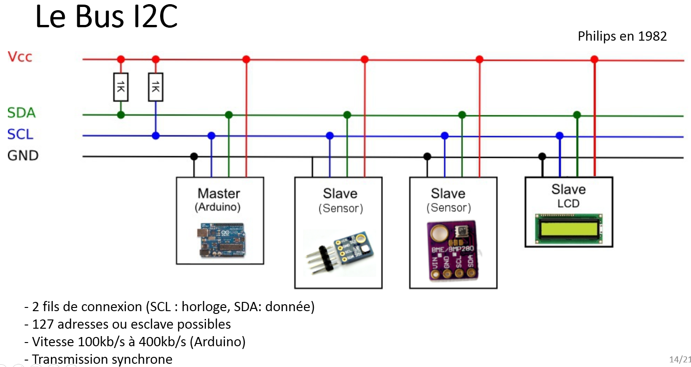
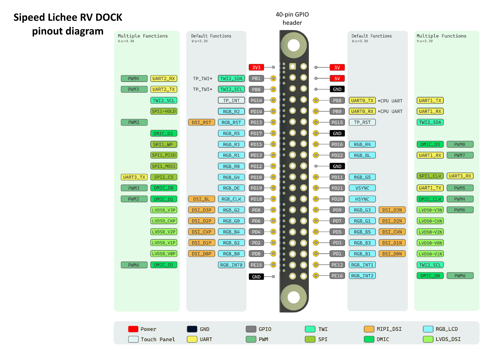

# Лабораторная №9. Добавление поддержки I2C интерфейса


## Цель работы

Изучить принципы работы I2C-интерфейса в одноплатных компьютерах под управлением Linux, освоить методы конфигурирования ядра и модификации Device Tree для добавления поддержки нового аппаратного интерфейса, а также получить практические навыки взаимодействия с I2C-устройствами из пользовательского пространства.

## Подготовительный материал

### Краткая теория о самом интерфейсе

I2C является шиной, т.е. к одним и тем же выводам может быть подключено несколько устройств. По стандарту на шине есть только одно ведущее устройство - Master, остальные - ведомые, Slave. Ведущее выбирает, с каким из ведомых взаимодействовать, может отправлять и читать с него данные. Ведущим обычно является основной МК в схеме, а остальные - различные цифровые микросхемы, датчики или вспомогательные МК.




## Постановка задачи

Основной целью лабораторной работы является обеспечение возможности взаимодействия с I2C-интерфейсом микроконтроллера Allwinner D1 из пользовательского пространства операционной системы Linux.

Для достижения данной цели необходимо решить ряд задач, возникающих при анализе аппаратной конфигурации исследуемой платы. При обращении к распиновке (схема или пин-аут) платы Lichee RV Dock можно не обнаружить записей об I2C. На самом деле **промышленное название I2C - TWI**. Поэтому нас будут интересовать пины TWI2_SDA и TWI2_SCL.



I2C использует 2 пина для подключения:

- SDA (Serial Data) - линия данных, передача в обе стороны. На модуле может быть подписан как SDA, D
- SCL (Serial Clock) - линия синхронизации, ей управляет мастер. На модуле может быть подписан как SCL, C, SCK


### Необходимые шаги

Для успешного решения поставленных задач необходимо выполнить следующие действия:

- Добавление и активация интерфейса в Device Tree
- Добавление драйвера поддержки интерфейса I2C в ядро


### Добавление и активация интерфейса в Device Tree

Необходимо по аналогии с задачей из лабораторной №7 в исходный файл платы добавить(или убедиться в наличии) переобъявление некоторых полей для i2c-интерфейса:

```
&i2c2 {
        pinctrl-0 = <&i2c2_pepg_pins>;
        pinctrl-names = "default";
        #compatible = "marvell,mv64xxx-i2c";
        status = "okay";
};
```

В заголовочный файл *sun20i-d1.dtsi* необходимо добавить объявление пинов SDA и SCL:

```
/omit-if-no-ref/
i2c2_pepg_pins: i2c2-pepg-pins {
        pins = НОМЕРА ПИНОВ ДЛЯ ИНТЕРФЕЙСА;
        function = "i2c2";
};
```

### Добавление драйвера поддержки интерфейса I2C в ядро 

Необходимо по аналогии с задачей из лабораторной №7 добавить в конфигурацию ядра поддержку следующих параметров:

- I2C
- I2C_MUX
- I2C_MV64XXX
- I2C_CHARDEV


### Добавление

Для простой работы с I2C-экраном и запуска тестового скрипта необходимо поставить пакет для нативной работы с такими экранами.

```
# apt-get install python3-module-luma-oled
```

### Результат работы

После выполнения всех шагов в каталоге */dev/* появляется символьное устройство i2c-0. Для проверки работоспособности интерфейса можно выполнить тестирование путем запуска программы вывода собственного имени и фамилии студента на экран SSD-1306:

```
#!/usr/bin/env python3

import sys
import time
from luma.core.interface.serial import i2c
from luma.oled.device import ssd1306
from luma.core.render import canvas
from PIL import ImageFont, ImageDraw

def display_large_centered(device, first_name, last_name):
    """Выводит имя и фамилию крупным шрифтом по центру"""
    
    # Преобразуем в нижний регистр
    first_name_lower = first_name.lower()
    last_name_lower = last_name.lower()
    
    # Пытаемся загрузить крупный шрифт
    try:
        # Для Raspberry Pi с установленными шрифтами
        font_large = ImageFont.truetype("/usr/share/fonts/truetype/dejavu/DejaVuSans.ttf", 16)
        font_small = ImageFont.truetype("/usr/share/fonts/truetype/dejavu/DejaVuSans.ttf", 12)
    except:
        # Если шрифт не найден, используем шрифт по умолчанию
        font_large = ImageFont.load_default()
        font_small = ImageFont.load_default()
    
    with canvas(device) as draw:
        # Для крупного шрифта используем две строки
        # Получаем размеры текста
        bbox_name = draw.textbbox((0, 0), first_name_lower, font=font_large)
        bbox_surname = draw.textbbox((0, 0), last_name_lower, font=font_large)
        
        name_width = bbox_name[2] - bbox_name[0]
        surname_width = bbox_surname[2] - bbox_surname[0]
        
        # Центрируем каждую строку
        x_name = (128 - name_width) // 2
        x_surname = (128 - surname_width) // 2
        
        # Выводим по центру
        draw.text((x_name, 15), first_name_lower, fill="white", font=font_large)
        draw.text((x_surname, 38), last_name_lower, fill="white", font=font_large)

def main():
    if len(sys.argv) != 3:
        print("Ошибка: нужно указать имя и фамилию как параметры запуска")
        print(f"Пример: {sys.argv[0]} Иван Петров")
        sys.exit(1)
    
    serial = i2c(port=0, address=0x3C)
    device = ssd1306(serial)
    device.clear()
    
    # Выводим имя и фамилию крупным шрифтом по центру
    display_large_centered(device, sys.argv[1], sys.argv[2])
    
    print(f"Выведено на экран: {sys.argv[1].lower()} {sys.argv[2].lower()}")
    
    # Держим экран включенным 10 секунд
    time.sleep(10)

if __name__ == "__main__":
    main()
```

Для работы с I2C-экраном необходимо подключить **пин VCC на нем с пином питания(5V) на одноплатнике, пины SDA,SCL, GND соответственно.**

**Результатом зафиксированным в отчете должен стать вывод на экранчик фамилии и имени студента.**


## Задание

Ознакомившись с подготовительным материалом к лабораторным №5, №6,№7 и №9 решить следующие подзадачи:

- Проанализировать файлы Device Tree платы Lichee RV Dock и внести необходимые модификации для активации I2C-интерфейсана пинах из банков PE и PG
- Добавить в конфигурацию ядра поддержку I2C-интерфейса путем включения перечисленных в материалах лабораторной параметров в конфигурацию ядра
- Собрать ядро с модифицированной конфигурацией и обновленными файлами дерева устройств
- Выполнить загрузку системы с новым ядром и проверить наличие устройства /dev/i2c-0
- Провести тестирование работоспособности I2C-интерфейса путем запуска программы вывода собственного имени и фамилии студента на экран SSD-1306
- **Продемонстрировать работу преподавателю**
- Сформировать отчет о выполнении поставленных задач .doc и **выслать на почту преподавателя до обозначенного срока**